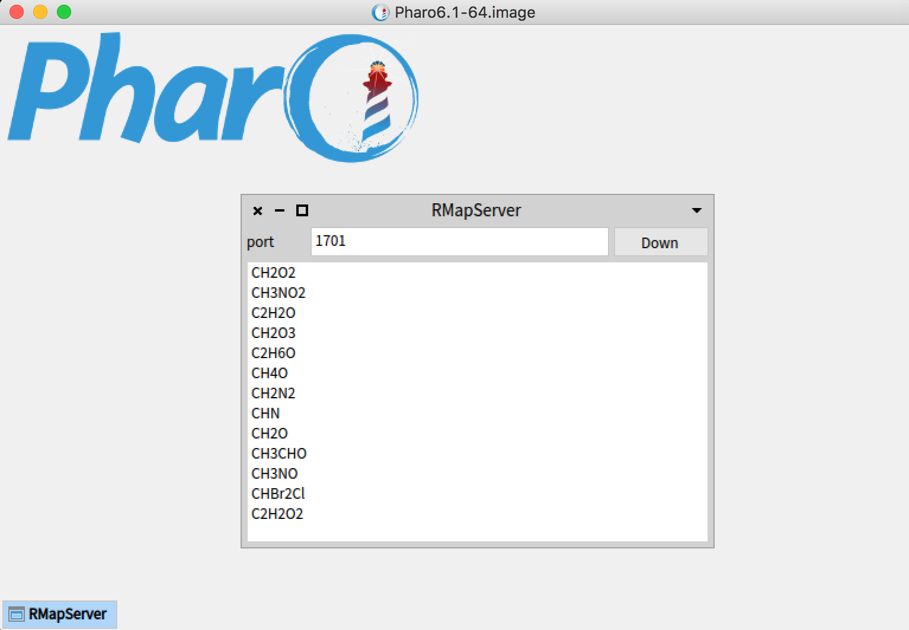
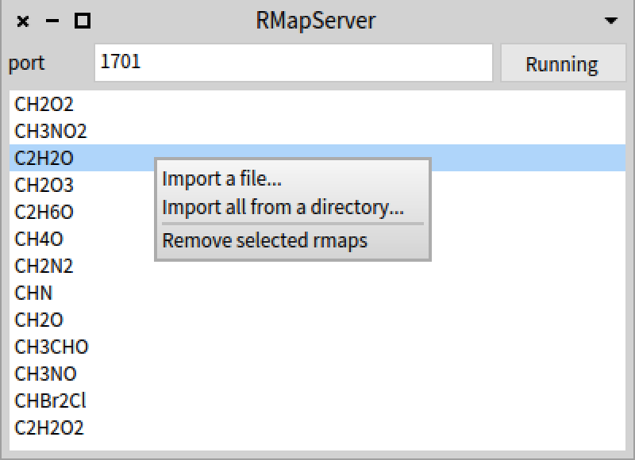
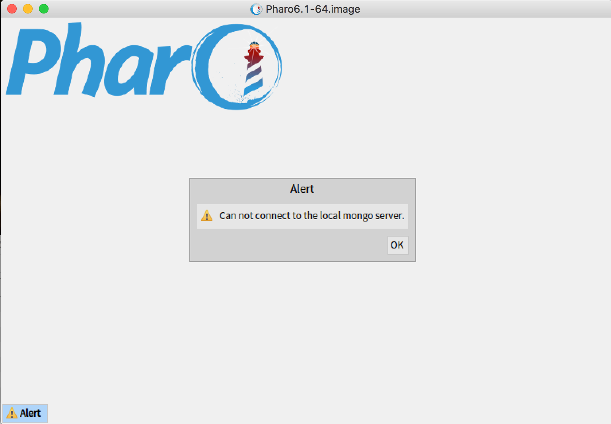
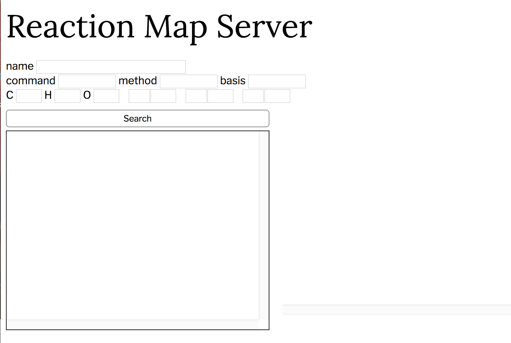
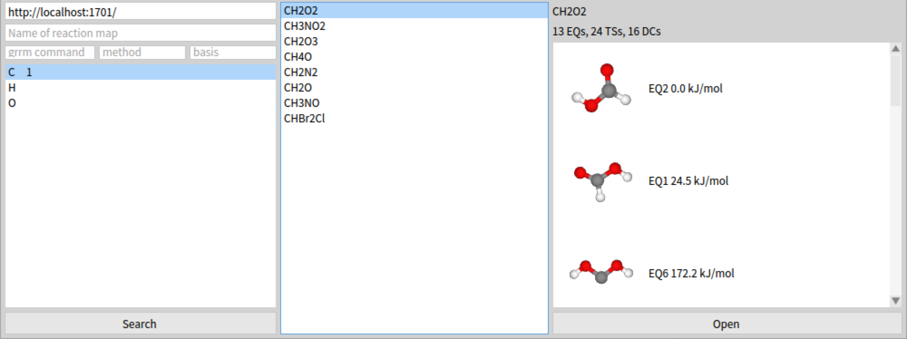

# RMapServer
ReactionMap server on Pharo Smalltalk

## Installation

1. Install MongoDB

RMapServer uses mongo db as its backend. Please set it up first.
If you are using MacOSX and [homebrew](https://brew.sh/index.html), you can install it by

```
brew install mongodb
```

2. Start a local MongoDB server (if you use mongo DB as a backend)

Please start a mongo server at your local machine.
In most OSs, you can launch it with the command shown below.

```
mongod
```

2. Install RMapServer

If you are a MacOSX user or a Linux-64 user, please download a zip file from the [release page](https://github.com/ReactionMap/RMapServer/releases).

If you are using other platforms, please download a [Pharo Smalltalk system](http://pharo.org/) and launch it.
Then, please evaluate the following piece of code, and save a snapshot.

```
Metacello new
    repository: 'github://ReactionMap/RMapServer/repository';
    baseline: 'RMapServer';
    load
```

3. Launch RMapServer

3.1. GUI mode

Please open the RMapServer. A window that looks like below will open.



The entry field on the top of the small window is the port number that the RMapServer will serve as an HTTP server.
The default is 1701.

The default backend is a directory-based server on $PHARO_DIR/pharo-local/ReactionMapServer .
If you want to use a local mongo DB server as a backend, please evaluate ```RMapServer useMongo```.
If you want to use a different directory as a repository, please evaluate ```RMapServer useDirectory: 'path-to-directory'```.

The button at the top right corner shows and controls the HTTP server process. If the system is running up, the button will show "Running". You can shut it down by pressing the button. If system is not running, the button will show "Down" and you can start it up by clicking it.

The list pane in the small window displays reaction maps that the server provide.
You can manage the list of rmaps you publish using a context menu by right-click.



You can add a single rmap file or a collection of files in a directory.
You can also remove one or more rmaps from the server by selecting them and choose "Remove selected rmaps" item from the context menu.
The reaction maps are stored on the local MongoDB. Moving or renaming the source rmap files will not affect the published list of reaction maps.

If you don't have a mongo DB process running on the local machine, you will have the following window and the RMapServer will be shutdown.



3.2. Headless mode

You can start a RMapServer in a headless mode with "rmapserver" command. It takes the following form.

```
./pharo Pharo.image rmapserver <mode> <option>
```

For example, a mongo-based RMapServer can be started by

```
./pharo Pharo.image rmapserver mongo
```

You can launch a directory-based RMapServer with the default repository:

```
./pharo Pharo.image rmapserver directory
```

or you can also specify the repository directory.

```
./pharo Pharo.image rmapserver directory /usr/local/rmapfiles
```

Headless mode does not provide GUI for managing the contents of the repository.
With mongo, you need to launch another RMapServer with GUI mode to manage the mongo-based repository.
With directory-based repository, you can add or remove rmap files into the directory. The RMapServer process will periodically watch the change of the repository.

4. Using clients

RMapServer can be accessed by either a web browser or RmapViewer.

4.1. Web browser

You can access the RMapServer by a web browser.
Please open http://localhost:1701/ to get the search page below.



Please type in a query by specifying name and/or grrm commands and/or elements and quantity in the compound of your concern.

4.2. RMapViewer

RMapViewer 6.0 and RMapViewerS 6 has functionality to search and view reaction maps from RMapServer.




